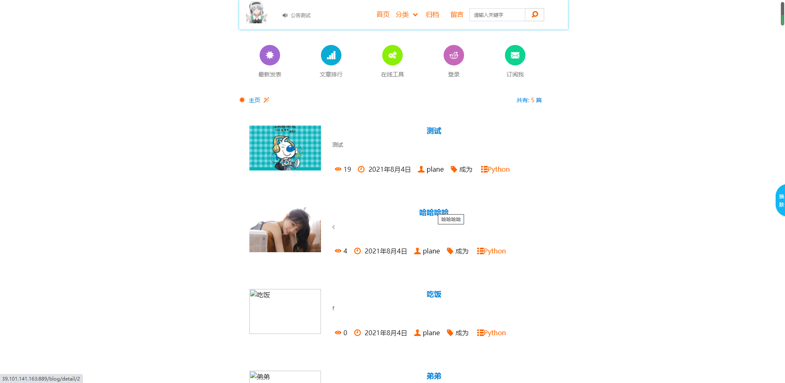

# 特点

* markdown 渲染，代码高亮
* 三方社会化评论系统支持(畅言)
* 背景随机切换
* 阅读排行榜/最新发表
* 多目标源博文分享
* 博文归档

### 为了测试 我的数据库是sqlite3  各位可以在 settings.py更改你们的mysql数据库
```
 'default': {
        # 配置mysql数据库，使用sqlite3的 跳过此步骤无需配置
        # 'ENGINE': 'django.db.backends.sqlite3',
        # 'NAME': BASE_DIR / 'db.sqlite3',
        'ENGINE': 'django.db.backends.mysql',  # 数据库引擎
        'NAME': 'ctango',  # 数据库名，自己本地创建
        'USER': 'root',  # 数据库用户名
        'PASSWORD': 'root',  # 数据库密码
        'HOST': '127.0.0.1',  #MySQL服务所在主机IP
        'PORT': '3306',  # MySQL服务端口
    }

```


# 安装
```
pip install -r requirements.txt  # 安装所有依赖
修改setting.py配置数据库
配置畅言：到http://changyan.kuaizhan.com/注册站点,将blog/templates/blog/message.html中js部分换成你在畅言中生成的APP ID APP SECRET。
畅言js位置: 进入工作台-》通用设置-》填好 网站基本信息 》回到 》 后台总览 》复制APPID APPSECRET到message.html中
python manage.py makemigrations blog
python manage.py migrate
创建管理员账号
python manage.py createsuperuser
python manage.py runserver


```

### 示例博客：<http://110.42.177.170>

### 下载地址：<https://github.com/zg10472580/My_Django_Blog_Test/releases/tag/%E4%BB%A3%E7%A0%81>

# 注意 
```
如遇到发表帖子的时候出现编码报错可运行目录上的Cj_Sql.py更改数据库编码
这个错误主要是发表帖子存在表情符号
```





